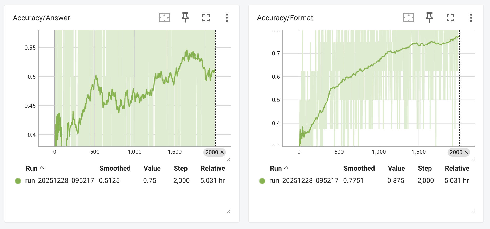

# MiniGRPO

A simplified, single-GPU implementation of Group Relative Policy Optimization (GRPO) for training language models. Together with a documentation to explain the implementation and training details and how GRPO works.   

## Why This Repo Exists
I believe the best way to learn something is to actually do it. 
 - If you want to understand GRPO down to the earth 
 - If you already have some experience playing with GRPO, but have questions for its details  

## Snapshot
This shows the training curve on a single A40 (40GB) for 2000 steps (about 4-5 hours, but the first 200 steps you already can see the trend).



## Documentation
Full documentation is available in the [docs/](docs/) folder.

## Features

- ✅ **Single GPU**: Both reference and training models on the same device
- ✅ **Simplified**: No distributed training complexity
- ✅ **Educational**: Well-documented with detailed explanations
- ✅ **Complete**: Full GRPO implementation with all key components

## Installation

```bash
# Clone the repository
git clone https://github.com/TianyiPeng/mini-grpo.git
cd mini-grpo

# Install dependencies using uv
uv sync
```

## Quick Start

```bash
# Run training (uses Qwen2.5-1.5B by default)
uv run python minigrpo.py

# In another terminal, view TensorBoard metrics
tensorboard --logdir ./logs/tensorboard
# Then open http://localhost:6006 in your browser

# Sample prompts and answers are logged to:
# ./logs/samples_{timestamp}.log
```

## Key Concepts Explained

- **KL Divergence**: Why `exp(diff) - diff - 1` (Schulman's estimator)
- **log_softmax**: Numerical stability and implementation
- **torch.gather**: Extracting per-token log probabilities
- **Memory Efficiency**: Loop-based processing for large vocabularies
- **GRPO Objective**: Complete mathematical formulation

## Differences from Multi-GPU Version

| Aspect | Multi-GPU | Single-GPU (This) |
|--------|-----------|-------------------|
| Reference Model | Separate server | Same process |
| Communication | HTTP + serialization | Direct GPU memory |
| Distributed | DeepSpeed + ZeRO | Standard PyTorch |
| Complexity | High | Low |

## Requirements

- Python 3.8+
- PyTorch 2.0+
- CUDA-capable GPU (16GB+ recommended)
- HuggingFace model access


## Acknowledgments

This project is heavily based on the excellent work from **[simple_GRPO](https://github.com/lsdefine/simple_GRPO)** by the KnowledgeWorks Lab at Fudan University. We extend our gratitude to:

- **Dr. Jiaqing Liang** and **Professor Yanghua Xiao** (project leaders)
- **Jinyi Han**, **Xinyi Wang**, **Zishang Jiang**, and other contributors

The core loss calculation formula is referenced from Hugging Face's [trl](https://github.com/huggingface/trl) library.

## References

- **simple_GRPO**: [https://github.com/lsdefine/simple_GRPO](https://github.com/lsdefine/simple_GRPO)
- GRPO Paper: Group Relative Policy Optimization
- Schulman, J. (2020): [Approximating KL Divergence](http://joschu.net/blog/kl-approx.html)
- Hugging Face trl: [https://github.com/huggingface/trl](https://github.com/huggingface/trl)


