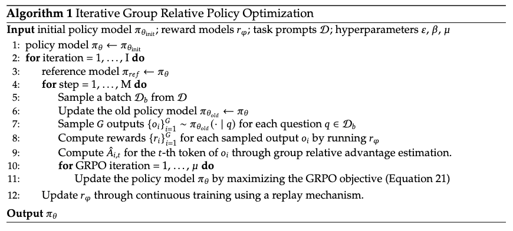
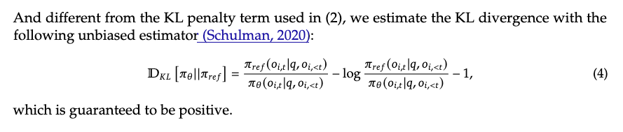

# GRPO Objective Function Explained

## Overview

This tutorial explains the Group Relative Policy Optimization (GRPO) objective function, focusing on:
1. The mathematical formulation of the GRPO objective
2. Why the KL divergence penalty uses the specific form `exp(diff) - diff - 1`
3. How it's implemented in the codebase
4. The connection to Schulman's unbiased KL estimator

## GRPO Algorithm

GRPO (Group Relative Policy Optimization) is a reinforcement learning algorithm for training language models. The algorithm iteratively:

1. Samples multiple outputs for each prompt using the current policy
2. Computes rewards for each output
3. Estimates group-relative advantages
4. Updates the policy to maximize the GRPO objective while staying close to a reference policy

### Algorithm Pseudocode



*Algorithm 1: Iterative Group Relative Policy Optimization from the GRPO paper.*

## Mathematical Formulation

### GRPO Objective Function

The GRPO objective combines:
1. **Policy gradient term**: Maximizes expected advantage using PPO-style clipping
2. **KL divergence penalty**: Prevents the policy from deviating too far from a reference policy

The complete objective is:

$$\mathcal{J}_{\text{GRPO}}(\theta) = \mathbb{E}\left[q \sim P(Q), \{o_i\}_{i=1}^G \sim \pi_{\theta_{\text{old}}}(O|q)\right] \left\{ \frac{1}{G} \sum_{i=1}^G \frac{1}{|o_i|} \sum_{t=1}^{|o_i|} \left\{ \min \left[ \frac{\pi_\theta(o_{i,t}|q, o_{i,<t})}{\pi_{\theta_{\text{old}}}(o_{i,t}|q, o_{i,<t})} \hat{A}_{i,t}, \text{clip}\left( \frac{\pi_\theta(o_{i,t}|q, o_{i,<t})}{\pi_{\theta_{\text{old}}}(o_{i,t}|q, o_{i,<t})}, 1-\epsilon, 1+\epsilon \right) \hat{A}_{i,t} \right] \right\} - \beta \mathbb{D}_{\text{KL}}[\pi_\theta || \pi_{\text{ref}}] \right\} \tag{1}$$

The KL divergence term $\mathbb{D}_{\text{KL}}[\pi_\theta || \pi_{\text{ref}}]$ is defined as:



Where:
- $\pi_\theta$: Current policy (being trained)
- $\pi_{\theta_{\text{old}}}$: Old policy (used for sampling)
- $\pi_{\text{ref}}$: Reference policy (typically frozen)
- $\hat{A}_{i,t}$: Group-relative advantage estimate for token $t$ of output $i$
- $\epsilon$: Clipping parameter (typically 0.2)
- $\beta$: KL penalty coefficient (typically 0.04)
- $G$: Number of outputs sampled per prompt

### Breaking Down the Objective

#### 1. Policy Gradient Term (PPO-style)

The policy gradient term uses PPO's clipped objective:

$$\min \left[ r_{i,t} \hat{A}_{i,t}, \text{clip}(r_{i,t}, 1-\epsilon, 1+\epsilon) \hat{A}_{i,t} \right] \tag{4}$$

where $r_{i,t} = \frac{\pi_\theta(o_{i,t}|q, o_{i,<t})}{\pi_{\theta_{\text{old}}}(o_{i,t}|q, o_{i,<t})}$ is the importance sampling ratio.

This ensures:
- **Conservative updates**: Prevents large policy changes
- **Stability**: Clips the ratio to prevent extreme values
- **Exploration**: Allows some deviation from the old policy

#### 2. KL Divergence Penalty

The KL divergence term $\beta \mathbb{D}_{\text{KL}}[\pi_\theta || \pi_{\text{ref}}]$ prevents the policy from deviating too far from the reference policy.

**Why KL divergence?**
- **Regularization**: Keeps the policy close to a known good policy
- **Prevents mode collapse**: Ensures diversity in outputs
- **Stability**: Prevents the policy from becoming too extreme

## Why This Specific KL Form?

### The Standard KL Divergence

The KL divergence from distribution $q$ to distribution $p$ is:

$$\text{KL}[q || p] = \sum_x q(x) \log \frac{q(x)}{p(x)} = \mathbb{E}_{x \sim q}\left[\log \frac{q(x)}{p(x)}\right] \tag{5}$$

For continuous distributions, this becomes an integral.

### The Problem with Direct Estimation

In our case, we want to estimate:

$$\text{KL}[\pi_\theta || \pi_{\text{ref}}] = \mathbb{E}_{x \sim \pi_\theta}\left[\log \frac{\pi_\theta(x)}{\pi_{\text{ref}}(x)}\right] \tag{6}$$

A naive Monte Carlo estimator with $x \sim \pi_\theta$ would be:

$$k_1 = -\log \frac{\pi_{\text{ref}}(x)}{\pi_\theta(x)} \tag{7}$$

**Problem**: This estimator has high variance because:
- It can be negative (when $\pi_\theta(x) < \pi_{\text{ref}}(x)$)
- KL divergence is always non-negative
- Half the samples contribute negative values, increasing variance

### Schulman's Unbiased Estimator

John Schulman proposed an unbiased, low-variance estimator in his blog post: [Approximating KL Divergence](http://joschu.net/blog/kl-approx.html)

For $\text{KL}[q || p]$ with samples $x \sim q$, the estimator is:

$$k_3 = (r - 1) - \log r \tag{8}$$

where $r = \frac{p(x)}{q(x)}$.

**Key properties**:
1. **Unbiased**: $\mathbb{E}_{x \sim q}[k_3] = \text{KL}[q || p]$
2. **Low variance**: Much lower variance than the naive estimator
3. **Always positive**: Uses the fact that $\log(x) \leq x - 1$ (Jensen's inequality)

### Derivation

The estimator comes from using a control variate. We start with the unbiased estimator:

$$k_1 = -\log r = -\log \frac{p(x)}{q(x)} = \log \frac{q(x)}{p(x)} \tag{9}$$

We can add any term with zero expectation. The natural choice is $r - 1 = \frac{p(x)}{q(x)} - 1$, which has expectation:

$$\mathbb{E}_{x \sim q}\left[\frac{p(x)}{q(x)} - 1\right] = \sum_x q(x) \left(\frac{p(x)}{q(x)} - 1\right) = \sum_x p(x) - q(x) = 1 - 1 = 0 \tag{10}$$

So for any $\lambda$, the expression $-\log r + \lambda(r - 1)$ is unbiased. Setting $\lambda = 1$ gives:

$$k_3 = (r - 1) - \log r \tag{11}$$

This is always positive because $\log(x) \leq x - 1$ (with equality only at $x = 1$), so:

$$k_3 = (r - 1) - \log r \geq 0 \tag{12}$$

### Application to GRPO

In GRPO, we need $\text{KL}[\pi_\theta || \pi_{\text{ref}}]$.

For $\text{KL}[\pi_\theta || \pi_{\text{ref}}]$ with samples $x \sim \pi_\theta$, Schulman's $k_3$ estimator uses $r = \frac{\pi_{\text{ref}}(x)}{\pi_\theta(x)}$:

$$k_3 = (r - 1) - \log r \tag{13}$$

This is exactly what our codebase computes. Let's see how:

**In the code**:
```python
diff = ref_per_token_logps - per_token_logps  # log(π_ref) - log(π_θ) = log(π_ref/π_θ)
per_token_kl = torch.exp(diff) - diff - 1
```

This computes:
- `diff = log(π_ref/π_θ)`
- `exp(diff) = π_ref/π_θ`
- `per_token_kl = (π_ref/π_θ) - log(π_ref/π_θ) - 1`

**Key insight**: The form `exp(diff) - diff - 1` where `diff = log(π_ref/π_θ)` is:
- Always positive (since $e^x \geq x + 1$ for all $x$)
- A valid divergence measure
- Numerically stable when `diff` is clipped

## Code Implementation

### GRPO Step Function

Here's how the GRPO objective is implemented in `grpo_ref_split.py`:

```python
def GRPO_step(batch):
    # 1. Get inputs and advantages
    prompt_length = batch['plen']
    inputs = batch['inputs'].to(engine.device)
    advantages = batch['rewards'].to(engine.device).unsqueeze(1)  # Group-normalized rewards
    
    # 2. Forward pass: compute current policy log probabilities
    logits = engine(inputs).logits
    logits = logits[:, :-1, :]  # (B, L-1, V)
    input_ids = inputs[:, 1:]   # (B, L-1)
    
    per_token_logps = get_per_token_logps(logits, input_ids)
    per_token_logps = per_token_logps[:, prompt_length-1:]  # Only completion tokens
    
    # 3. Get reference policy log probabilities
    ref_per_token_logps = batch['refs'].to(per_token_logps.device)
    
    # 4. Compute KL divergence penalty
    diff = ref_per_token_logps - per_token_logps  # log(π_ref/π_θ)
    diff_clipped = torch.clamp(diff, min=-50.0, max=50.0)  # Prevent exp overflow
    per_token_kl = torch.exp(diff_clipped) - diff_clipped - 1  # KL estimator
    
    # 5. Compute policy gradient term (PPO-style)
    if 'gen_logps' in batch:
        # Use importance sampling ratio with clipping
        gen_logps_device = batch['gen_logps'].to(engine.device)
        ratio = torch.exp(per_token_logps - gen_logps_device)  # π_θ/π_old
        clipped_ratio = torch.clamp(ratio, 1-clip_param, 1+clip_param)
        per_token_loss = torch.min(ratio * advantages, clipped_ratio * advantages)
    else:
        # Simplified version (no importance sampling)
        per_token_logps_detached = per_token_logps.detach()
        per_token_loss = torch.exp(per_token_logps - per_token_logps_detached) * advantages
    
    # 6. Combine policy gradient and KL penalty
    # Note: We maximize the objective, so loss = -objective
    per_token_loss = -(per_token_loss - beta * per_token_kl)
    
    # 7. Average over tokens (only completion tokens, not prompts)
    completion_mask = (inputs[:, prompt_length:] != tokenizer.pad_token_id).int()
    loss = ((per_token_loss * completion_mask).sum(dim=1) / 
            (completion_mask.sum(dim=1) + 1e-8)).mean()
    
    return loss
```

### Key Code Sections Explained

#### 1. KL Divergence Computation

```python
diff = ref_per_token_logps - per_token_logps  # log(π_ref/π_θ)
diff_clipped = torch.clamp(diff, min=-50.0, max=50.0)  # Prevent exp overflow
per_token_kl = torch.exp(diff_clipped) - diff_clipped - 1
```

**Why clip `diff`?**
- `exp(88) ≈ 1e38`, which exceeds `bfloat16`'s maximum value
- Clipping to `[-50, 50]` ensures numerical stability
- The KL estimator remains valid even with clipping (just less accurate for extreme values)

**Mathematical form**:
- `diff = log(π_ref/π_θ)`
- `exp(diff) = π_ref/π_θ`
- `per_token_kl = (π_ref/π_θ) - log(π_ref/π_θ) - 1`

This is always positive because $e^x \geq x + 1$ for all $x$ (with equality only at $x = 0$).

#### 2. Policy Gradient Term

```python
if 'gen_logps' in batch:
    ratio = torch.exp(per_token_logps - gen_logps_device)  # π_θ/π_old
    clipped_ratio = torch.clamp(ratio, 1-clip_param, 1+clip_param)
    per_token_loss = torch.min(ratio * advantages, clipped_ratio * advantages)
```

**PPO clipping**:
- `ratio`: Importance sampling ratio $\frac{\pi_\theta}{\pi_{\text{old}}}$
- `clipped_ratio`: Ratio clipped to $[1-\epsilon, 1+\epsilon]$ where $\epsilon = 0.2$
- `torch.min`: Takes the minimum of unclipped and clipped objectives

This ensures conservative policy updates.

#### 3. Combining Terms

```python
per_token_loss = -(per_token_loss - beta * per_token_kl)
```

**Why the negative sign?**
- We want to **maximize** the objective: `policy_loss - beta * KL`
- PyTorch optimizers **minimize** loss
- So we negate: `loss = -(policy_loss - beta * KL) = -policy_loss + beta * KL`

**Hyperparameters**:
- `beta = 0.04`: KL penalty coefficient
- `clip_param = 0.2`: PPO clipping parameter

## Comparison with Standard PPO

| Aspect | PPO | GRPO |
|--------|-----|------|
| **Objective** | Policy gradient + entropy bonus | Policy gradient + KL penalty |
| **Reference** | None (or previous policy) | Separate reference policy |
| **Advantages** | Per-sample | Group-relative (normalized within group) |
| **KL Term** | Not used | $\beta \cdot \text{KL}[\pi_\theta \|\| \pi_{\text{ref}}]$ |
| **Sampling** | Single sample per prompt | Multiple samples per prompt (group) |

## Why Group-Relative Advantages?

GRPO uses **group-relative advantages** instead of absolute rewards:

```python
# In generate_mode, advantages are computed as:
advantages = (rewards - rewards.mean(axis=1, keepdims=True)) / (rewards.std(axis=1, keepdims=True) + 1e-8)
```

**Benefits**:
1. **Relative comparison**: Compares outputs within the same prompt group
2. **Stability**: Normalization reduces variance
3. **Better signal**: Focuses on relative quality rather than absolute reward scale

## Numerical Stability Considerations

### 1. Clipping KL Differences

```python
diff_clipped = torch.clamp(diff, min=-50.0, max=50.0)
```

Prevents `exp(diff)` from overflowing when `diff > 88` (for `bfloat16`).

### 2. Handling NaN/Inf

The code includes extensive checks for NaN/Inf values:
- Checks logits after forward pass
- Checks reference log probabilities
- Replaces NaN/Inf with safe values (`-100.0`)

### 3. Completion Masking

```python
completion_mask = (inputs[:, prompt_length:] != tokenizer.pad_token_id).int()
loss = ((per_token_loss * completion_mask).sum(dim=1) / 
        (completion_mask.sum(dim=1) + 1e-8)).mean()
```

Only computes loss over actual completion tokens, not padding tokens.

## Summary

The GRPO objective function:

1. **Maximizes policy gradient**: Uses PPO-style clipping to improve policy
2. **Penalizes KL divergence**: Keeps policy close to reference using Schulman's estimator
3. **Uses group-relative advantages**: Normalizes rewards within groups for stability

The KL divergence estimator `exp(diff) - diff - 1` is:
- **Unbiased** (or approximately so)
- **Low variance** compared to naive estimator
- **Always positive** (ensures valid divergence measure)
- **Numerically stable** when differences are clipped

This form comes from Schulman's work on approximating KL divergence with Monte Carlo methods, providing a practical and stable way to regularize policy updates in reinforcement learning.

## References

1. **Schulman, J. (2020)**: [Approximating KL Divergence](http://joschu.net/blog/kl-approx.html) - Explains the unbiased KL estimator used in GRPO
2. **GRPO Paper**: Group Relative Policy Optimization algorithm
3. **PPO Paper**: Proximal Policy Optimization algorithms (foundation for GRPO)

## Further Reading

- `tutorial/log_softmax_stability.md`: Why numerical stability matters for log probabilities
- `tutorial/torch_gather_explained.md`: How per-token log probabilities are extracted
- `tutorial/memory_efficient_logprobs.md`: Memory optimization in log probability computation

